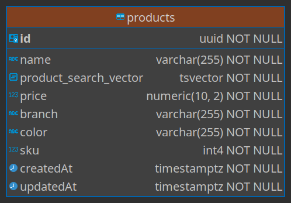
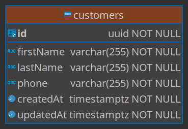
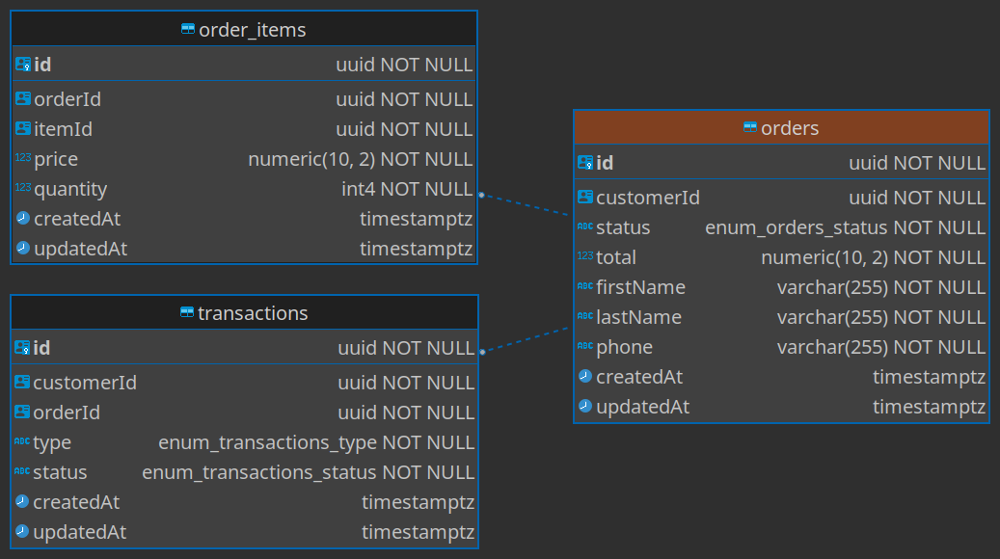
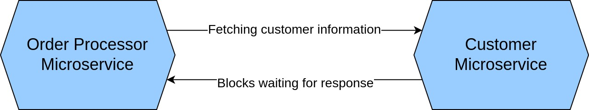
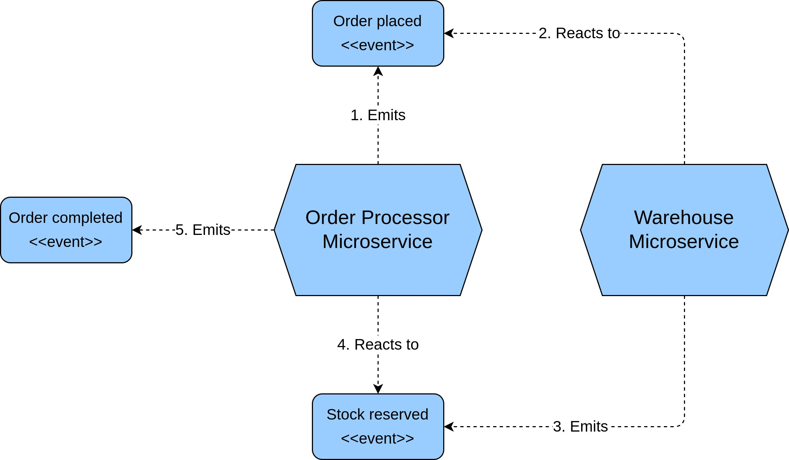
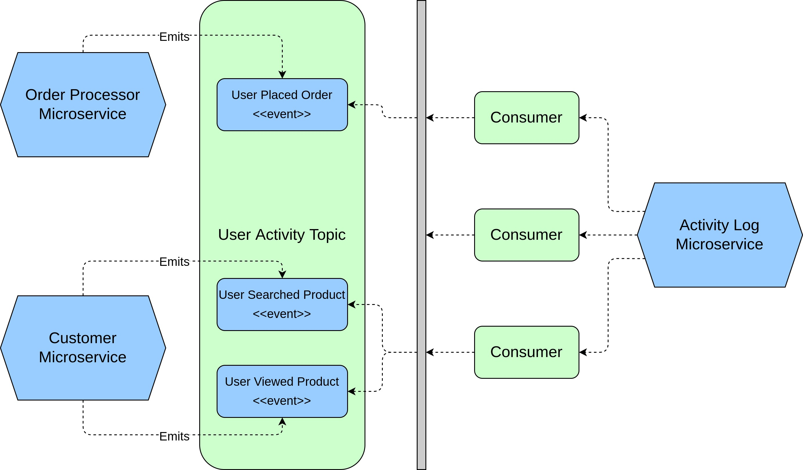
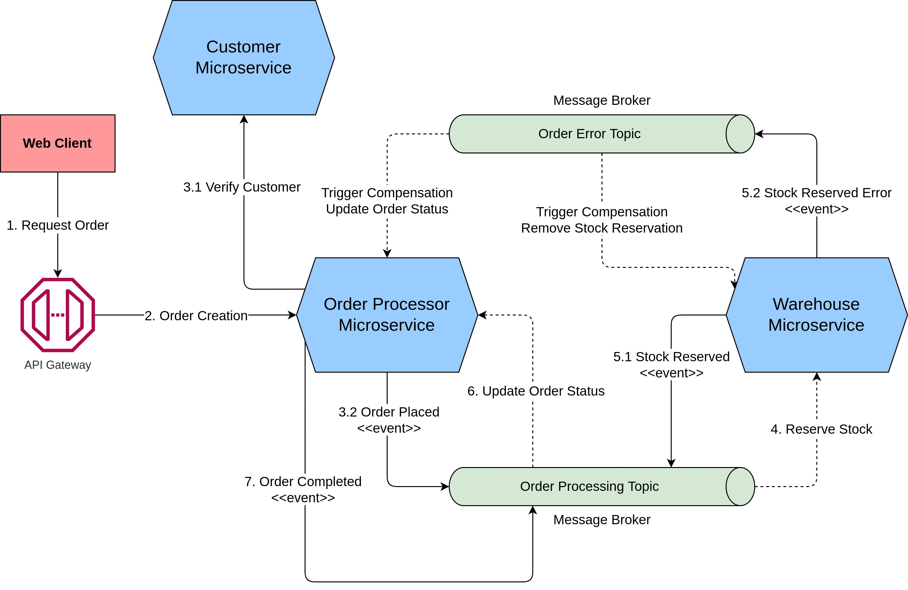
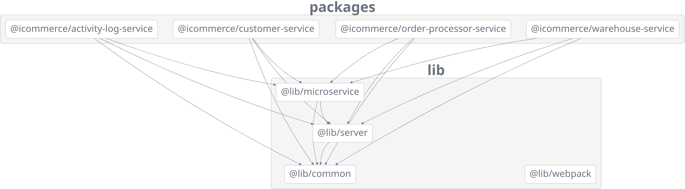

## iCommerce

- [iCommerce](#icommerce)
  - [High Level Architecture](#high-level-architecture)
  - [Database Design](#database-design)
    - [Warehouse Microservice](#warehouse-microservice)
    - [Customer Microservice](#customer-microservice)
    - [Order Processor Microservice](#order-processor-microservice)
    - [Activity Log Service](#activity-log-service)
  - [Development Principles and Patterns](#development-principles-and-patterns)
    - [Microservice Modeling](#microservice-modeling)
    - [Microservice Communication Styles](#microservice-communication-styles)
      - [Synchronous Blocking via HTTP calls](#synchronous-blocking-via-http-calls)
      - [Asynchronous Nonblocking using Message Broker](#asynchronous-nonblocking-using-message-broker)
    - [Microservice Worflow - SAGA Pattern](#microservice-worflow---saga-pattern)
      - [Order Processing Message Broker](#order-processing-message-broker)
    - [Microservice Security](#microservice-security)
    - [Microservice Testing](#microservice-testing)
  - [Installation Guides](#installation-guides)
  - [Project Structure, Frameworks and Libraries](#project-structure-frameworks-and-libraries)
    - [Codebase Structure](#codebase-structure)
    - [Frameworks and Tools](#frameworks-and-tools)
    - [Open-source Packages](#open-source-packages)
  - [API Endpoints](#api-endpoints)
    - [Get Product Detail](#get-product-detail)
    - [Fetch, Search and Filter Products](#fetch-search-and-filter-products)
    - [Find or Create Customer](#find-or-create-customer)
    - [Fetch Customer Detail](#fetch-customer-detail)
    - [Create New Order](#create-new-order)

### High Level Architecture

- authentication for order api??
- cloud events, message format
- rabittmq structure (channels, exchanges, queue, etc)
- rate limit for order placed API???

### Database Design

We use two types of database to store our data:

- Relational database (PostgreSQL): to store products, orders and customers.
- Non-relational database (MongoDB): to store activity logs.

We'll go through the database structure and schema for each microservice. Some microservices are quite simple so they may contain only single table or collection.

#### Warehouse Microservice



This microservice has a single table called `products` with the following fields:

- `id`: table primary key in UUID format.
- `name`: product name.
- `product_search_vector`: in order to search for products, we utilize the PostgreSQL full text search capabilities (`to_tsvector` and `to_tsquery`). This column contains the vector after we convert the document using `to_tsvector` function. The content of this column will be updated using a trigger, so that it's up-to-date with new product attributes. We combine the three columns (searchable columns) before converting to vector: `name`, `branch` and `color`. One caveat is that we assume all texts are in English. More information can be found in [this migration](./packages/warehouse-service/src/database/migrations/20220709083425-create-products-table.js).
- `price`: product price in the form of `x.yy` (e.g. `1.99`).
- `branch`: product branch.
- `color`: product color.
- `sku`: product Stock Keeping Unit. This column value will be used by `order-processor` microservice to check the the availability of the products associated with a given order.
- `createdAt` and `updatedAt`: automatically generated timestamps for the record.

We also add some indices to support the searching and filtering functionalities.

- A compound index for `branch` and `color`:

```sql
CREATE INDEX products_branch_color ON products USING btree(branch, color);
```

- A full text index for `product_search_vector`:

```sql
CREATE INDEX products_search ON products USING gin(product_search_vector);
```

#### Customer Microservice



This microservice has a table called `customers` to store customer information. Although, we don't provide the registration feature, we still need to store the customer information in order to support the `order-processor` microservice. Customers are indexed by their phone number. We retrieve or create new customer from information sent from `order-processor` microservice.

- `id`: table primary key in UUID format.
- `firstName`: customer first name.
- `lastName`: customer last name.
- `phone`: customer phone number.
- `createdAt` and `updatedAt`: automatically generated timestamps for the record.

We just add an additional unique index for `phone`:

```sql
CREATE UNIQUE INDEX customers_phone ON customers USING btree(phone);
```

#### Order Processor Microservice



This microservice has three tables: `orders`, `order_items` and `transactions`. The relationships between these table are as follows. Those relationships are represented by foreign keys between tables.

- One order can have multiple order items.
- One order has one transaction.

**The** `orders` **table**:

- `id`: table primary key in UUID format.
- `customerId`: the customer associated with the order. We don't support registration functionality; however, we still track customers using their information like phone number. The value of this column is obtained from `customer` microservice.
- `status`: the order status including: `new`, `pending` and `complete`.
- `total`: the total amount of the order. In the scope of this project, the total will be the sum of all order items price. As we don't support taxes or promotions, we don't introduce other columns like `subtotal` for simplicity.
- `firstName`, `lastName`, and `phone`: the customer information associated with the order. Those information would be stored in `customer` microservice as well. However, normally when viewing order details we need to fetch customer information in process. Putting some of customer common attributes here would reduce the communication between microservices.
- `createdAt` and `updatedAt`: automatically generated timestamps for the record.

This table has index for `customerId` column:

```sql
CREATE INDEX orders_customer_id ON public.orders USING btree("customerId");
```

**The** `order_items` **table**:

- `id`: table primary key in UUID format.
- `orderId`: the associated order.
- `itemId`: the associated product. The value of this column should be obtained from `warehouse` microservice.
- `price`: the product unit price.
- `quantity`: the quantity of the product.
- `createdAt` and `updatedAt`: automatically generated timestamps for the record.

This table has indices for `orderId` and `itemId` columns:

```sql
CREATE INDEX order_items_item_id ON public.order_items USING btree("itemId");
CREATE INDEX order_items_order_id ON public.order_items USING btree("orderId");
```

**The** `transactions` **table**:

- `id`: table primary key in UUID format.
- `customerId`: the customer associated with the order.
- `orderId`: the associated order.
- `type`: in this project we have two transaction types: `general` and `refund`. We probpably have more transactional types in real application.
- `status`: the transaction status including: `new`, `pending` and `success`.
- `createdAt` and `updatedAt`: automatically generated timestamps for the record.

This table has indices for `orderId` and `customerId` columns:

```sql
CREATE INDEX transactions_customer_id ON public.transactions USING btree("customerId");
CREATE INDEX transactions_order_id ON public.transactions USING btree("orderId");
```

If we support online payments, this table would includes other information such as: payment transaction reference, payment transaction status, payment provider information, etc.

#### Activity Log Service

This service use non-relational database MongoDB to store stream of events or activity logs. The database has a single collection for store user activity logs such as: placing order, searching and filtering products, etc. The collection is named `user_activities`. Each document inside collection has following structure:

- `type`: the type of the activity, basicially it's the event name.
- `userId`: for some actions performed by a user, the identity of the client is consisdered anonymous. For example, when users browse the product catalog or view a specific product. The value of this `userId` attribute is the hashed value of domain, IP address and user agent where the request is originated.
- `payload`: the payload of the activity. The content of this attribute is quite flexible. It depends of each event type. We'll dicuss more about this in event collaboration section.

### Development Principles and Patterns

#### Microservice Modeling

TODO - DDD, CQRS, Event Sourcing, Domain Driven Design

#### Microservice Communication Styles

To support data transfer between microservices, we use the following communication styles:

- Synchronous Blocking via HTTP calls.
- Asynchronous Nonblocking using event-driven approach, specifically, using topic-based message brokers.

##### Synchronous Blocking via HTTP calls



When placing new order by calling `POST /v1/orders` endpoint, the `order-processor` microservice need to process the customer information along the way. Here, the `order-processor` microservice will pass that responsibility to the downstream `customer` microservice. This process is done by calling `POST /v1/customers` endpoint exposed by `customer` microservice. This call to downstream microservice is blocking which means `order-processor` microservice must wait until the call has completed and potentially a response has been sent back from `customer` microservice.

This method is used here to make sure the customer is persisted in our database before moving on to other actions. We don't implement a chain of blocking calls between a lot of microservices here, so this method is suitable for our current use case.

This communication style has downsides. For example, `customer` microservice need to be reachable from `order-processor` microservice; otherwise, the operation carried by `order-processor` will fail. In that situation, `order-processor` microservice need to decide on complensating action to carry out. On possible action could be retrying the call until we reach a timeout or a maximum number of retries. Another issue is that `customer` may have a slow response time due to high load, network latency or performance degration. In those cases, the overall operation will be blocked for a prolonged period of time.

##### Asynchronous Nonblocking using Message Broker

Different from synchronous blocking communication style, asynchronous nonblocking communication style is based on message broker. The message broker is a messaging system that allows microservices to communicate with each other. The message broker is a middleware that sits between the microservices and the underlying system. Rather than a microservice asking other microservices to do something, a microservice just emits their events and other microservices can listent to those events if they need. This communication style is asynchronous as event handlers will be running in their own thread of execution.

**Order Creation Event Collaboration**



Placing an order is responsibility of several microservices in our system, inclucing: `order-processor`,`customer` and `warehouse`. Basicially speaking,

- `order-processor`: is the one that creates the order. This order is in `new` status.
- `customer`: is responsible to fetch or create customer.
- `warehouse`: is responsible to reserve stocks for order items or products.

We've already discussed the communication style between `order-processor` and `customer` microservices in the previous section. The figure above shows the event collaboration between `order-processor` and `warehouse` microservices.

1. `order-processor` fires **Order Placed** event after the order is created.
2. `warehouse` listens to **Order Placed** event and reserve the stocks for products of the order. The products information can be found in the content of the event payload.
3. `warehouse` fires a new event called **Stock Reserved** to notify other parties that the stocks are reserved to given list of products.
4. `order-processor` listens to **Stock Reserved** event and update the order status to `complete`.
5. `order-processor` fires a new event called **Order Completed** to notify other parties that the order is completed.

Here, we just illustrate the happy path when creating new order. We'll discuss edge cases in the following sections.

Sample events that are fired during order creation process.

`Order Placed` Event: a fully detailed event that contains all information about the newly created order.

```json
{
  "id": "7de145e9-4304-4b0f-9a6b-e0ce310c0028",
  "time": "2022-07-16T09:18:46.749Z",
  "type": "order:placed",
  "source": "order-processor-service:order:e10f1d81-ce52-4e84-93e7-77898e9eb7f0",
  "specversion": "1.0",
  "datacontenttype": "application/json",
  "metadata": {},
  "data": {
    "id": "e10f1d81-ce52-4e84-93e7-77898e9eb7f0",
    "customerId": "4ca06e5f-eb3c-4e20-ba03-338a2d0befd5",
    "status": "new",
    "total": "105.00",
    "firstName": "Vinh",
    "lastName": "Nguyen",
    "phone": "+84349609698",
    "createdAt": "2022-07-16T09:18:46.729Z",
    "updatedAt": "2022-07-16T09:18:46.729Z",
    "orderItems": [
      {
        "id": "7bae9f70-6672-4431-8a21-51291e4f7238",
        "orderId": "e10f1d81-ce52-4e84-93e7-77898e9eb7f0",
        "itemId": "314fb0ac-5e5d-4ca3-ace4-6465620b6eb7",
        "price": "15.00",
        "quantity": 2,
        "createdAt": "2022-07-16T09:18:46.735Z",
        "updatedAt": "2022-07-16T09:18:46.735Z"
      },
      {
        "id": "58f028d8-7997-434d-92dd-8db8065efd95",
        "orderId": "e10f1d81-ce52-4e84-93e7-77898e9eb7f0",
        "itemId": "46bfcb7b-d769-45fb-8d8c-2b5079458e95",
        "price": "25.00",
        "quantity": 3,
        "createdAt": "2022-07-16T09:18:46.735Z",
        "updatedAt": "2022-07-16T09:18:46.735Z"
      }
    ]
  }
}
```

`Stock Reserved` Event: this event contains the order ID as the `order-processor` already has detailed information of a given order.

```json
{
  "id": "6e360f95-4ec9-432e-a50b-fda5f71ae429",
  "time": "2022-07-16T09:18:46.775Z",
  "type": "warehouse:stock:reserved",
  "source": "warehouse-service:order:e10f1d81-ce52-4e84-93e7-77898e9eb7f0",
  "specversion": "1.0",
  "datacontenttype": "application/json",
  "metadata": {},
  "data": {
    "orderId": "e10f1d81-ce52-4e84-93e7-77898e9eb7f0"
  }
}
```

`Order Completed` Event: this event contains basic information of the order (not including the order items, e.g.)

```json
{
  "id": "20cde975-4dc1-435c-8c7d-6425bc0a6acf",
  "time": "2022-07-16T09:18:46.785Z",
  "type": "order:completed",
  "source": "order-processor-service:order:e10f1d81-ce52-4e84-93e7-77898e9eb7f0",
  "specversion": "1.0",
  "datacontenttype": "application/json",
  "metadata": {},
  "data": {
    "id": "e10f1d81-ce52-4e84-93e7-77898e9eb7f0",
    "customerId": "4ca06e5f-eb3c-4e20-ba03-338a2d0befd5",
    "status": "complete",
    "total": "105.00",
    "firstName": "Vinh",
    "lastName": "Nguyen",
    "phone": "+84349609698",
    "createdAt": "2022-07-16T09:18:46.729Z",
    "updatedAt": "2022-07-16T09:18:46.781Z"
  }
}
```

**Storing Activity Logs Event Collaboration**



The `activity-log` microservice will collect events from other microservices and store the logs accordingly. T300%his microservice doesn't emit any events to outside world (as ilustrated in the above diagram). Basicially, this microservice receives events from `order-processor` and `warehouse` microservices. Those events include:

- `User Placed Order`
- `User Viewed Product`
- `User Search Products`

All event will be published to `user:activities` topic. On `activity-log` microservice, we define multiple consumers to speed up the event processing performance.

Sample events that are processed by `activity-log` microservice.

`User Placed Order` Event: this event contains detailed information about the order as well as user request information such as domain, IP address and user agent.

```json
{
  "id": "a675e637-055d-4ed8-92cf-76805e8a3323",
  "time": "2022-07-16T09:18:46.756Z",
  "type": "user:order:placed",
  "source": "order-processor-service:order:e10f1d81-ce52-4e84-93e7-77898e9eb7f0",
  "specversion": "1.0",
  "datacontenttype": "application/json",
  "metadata": {
    "userid": "89286d4dc3a77e24e385ae83718c95596de6c9b59564e380127702c0f2b925ee",
    "requestinfo": {
      "domain": "localhost:3002",
      "ip": "::1",
      "userAgent": "PostmanRuntime/7.29.0"
    }
  },
  "data": {
    "id": "e10f1d81-ce52-4e84-93e7-77898e9eb7f0",
    "customerId": "4ca06e5f-eb3c-4e20-ba03-338a2d0befd5",
    "status": "new",
    "total": "105.00",
    "firstName": "Vinh",
    "lastName": "Nguyen",
    "phone": "+84349609698",
    "createdAt": "2022-07-16T09:18:46.729Z",
    "updatedAt": "2022-07-16T09:18:46.729Z",
    "orderItems": [
      {
        "id": "7bae9f70-6672-4431-8a21-51291e4f7238",
        "orderId": "e10f1d81-ce52-4e84-93e7-77898e9eb7f0",
        "itemId": "314fb0ac-5e5d-4ca3-ace4-6465620b6eb7",
        "price": "15.00",
        "quantity": 2,
        "createdAt": "2022-07-16T09:18:46.735Z",
        "updatedAt": "2022-07-16T09:18:46.735Z"
      },
      {
        "id": "58f028d8-7997-434d-92dd-8db8065efd95",
        "orderId": "e10f1d81-ce52-4e84-93e7-77898e9eb7f0",
        "itemId": "46bfcb7b-d769-45fb-8d8c-2b5079458e95",
        "price": "25.00",
        "quantity": 3,
        "createdAt": "2022-07-16T09:18:46.735Z",
        "updatedAt": "2022-07-16T09:18:46.735Z"
      }
    ]
  }
}
```

`User Viewed Product` Event:

```json
{
  "id": "ae5eecae-36f7-40d8-97f9-2f50d9a66456",
  "time": "2022-07-16T09:39:44.729Z",
  "type": "user:product:viewed",
  "source": "warehouse-service:product:6e7f704d-4f80-4fe0-9de5-46ff15d2fc11",
  "specversion": "1.0",
  "datacontenttype": "application/json",
  "metadata": {
    "userid": "fc1b456b4e3cc75a25f2e392ff2af83d25ef55bc14512392173960877b70913f",
    "requestinfo": {
      "domain": "localhost:3001",
      "ip": "::1",
      "userAgent": "PostmanRuntime/7.29.0"
    }
  },
  "data": {
    "id": "6e7f704d-4f80-4fe0-9de5-46ff15d2fc11",
    "name": "Elegant Fantastic Metal Pizza",
    "price": "699.00",
    "branch": "Soft",
    "color": "maroon",
    "sku": 3,
    "createdAt": "1999-04-22T03:33:56.893Z",
    "updatedAt": "2030-09-26T12:07:28.229Z"
  }
}
```

`User Searched Product` Event: this event contains the search queries from the user and the list of matched products. Note that we only include the list of products in the first page of the paginated result.

```json
{
  "id": "3a708204-a756-4a87-8729-c87e3e29cf63",
  "time": "2022-07-16T09:40:52.165Z",
  "type": "user:product:searching:filtering",
  "source": "warehouse-service:products",
  "specversion": "1.0",
  "datacontenttype": "application/json",
  "metadata": {
    "userid": "fc1b456b4e3cc75a25f2e392ff2af83d25ef55bc14512392173960877b70913f",
    "requestinfo": {
      "domain": "localhost:3001",
      "ip": "::1",
      "userAgent": "PostmanRuntime/7.29.0"
    }
  },
  "data": {
    "query": {
      "search": "elegant",
      "filter": "color:maroon,branch:Soft",
      "sortBy": "createdAt:desc,name:asc",
      "limit": "2",
      "offset": "0"
    },
    "matchedProductIds": [
      "4b2c535c-a10d-40e5-9e66-f9b1ce2edd3b",
      "7c9e1559-fa85-4ae6-a08a-abf0a539b602"
    ]
  }
}
```

We use RabbitMQ to implement all event-driven operations in the system. It acts as both producer and consumer of events. Producers use an API (via Node.js SDK) to publish an event to the message broker. The broker handles subscriptions and notify consumers when an event arrives. Event-driven architecture can help to create more decoupled and scalable systems. However, this communication style also adds complexity to system infrastructure. We may face the situation where events are lost or the same event is sent multiple times.

#### Microservice Worflow - SAGA Pattern

##### Order Processing Message Broker



#### Microservice Security

#### Microservice Testing

### Installation Guides

This project is written in Node.js, so before you can use it, you need to install Node.js.
Make sure you have Node.js `v16` installed on your computer.

- Node.js: `v.16.x` (tested with `v16.15.0`)
- NPM: `8.5.x` (tested with `8.5.5`)

We use Docker and Docker Compose for constructing the development environment of the applications. Therefore, we need to install these two softwares:

- Install Docker: https://docs.docker.com/get-docker
- Install Docker Compose: https://docs.docker.com/compose/install

Make sure `docker` and `docker-compose` commands are available in your PATH.

To simplify the development process, all microservices and shared libraries are contained in
a single repository. We use [Lerna](https://lerna.js.org) to manage dependencies and relationships between them.

To start the installation process, run the `setup-dev.sh` script located at project root.

```bash
$ ./setup-dev.sh
```

This simple script will do the followings:

- Starting Docker containers for PostgreSQL, RabbitMQ, and MongoDB.
- Installing packages and dependencies for microservices and shared libraries.
- Migrating databases and seeding test data (for PostgreSQL).

Our microservices are located in `packages` directory. Each microservice has a `dev.sh` script. Running that script will start the local Node.js server for microservices. We've four services and each service will run in different port.

- `warehouse-service`: `3001`
- `order-processor-service`: `3002`
- `customer-service`: `3003`
- `activity-log-service`: `3004`

### Project Structure, Frameworks and Libraries

#### Codebase Structure

Here's the general structure of project codebase.

```
.
├── babel.config.js
├── docker-compose.yml
├── docs
│   └── images
├── .editorconfig
├── .eslintignore
├── .eslintrc.js
├── .gitignore
├── .husky
│   ├── _
│   └── pre-commit
├── index.d.ts
├── lerna.json
├── lib
│   ├── common
│   ├── microservice
│   ├── server
│   └── webpack
├── nx.json
├── .nx-cache
├── package.json
├── package-lock.json
├── packages
│   ├── activity-log-service
│   ├── customer-service
│   ├── order-processor-service
│   └── warehouse-service
├── .prettierignore
├── .prettierrc
├── README.md
├── setup-dev.sh
├── tsconfig.eslint.json
└── tsconfig.json
```

There're two main directories we need to focus on: `lib` and `packages`. Other are just configurations files for build tools, linter, TypeScript, etc.

The `lib` directory contains shared codes and libraries that will be used by our microservices. All packages in `lib` will has the name with prefix `@lib/`.

- `common`: contains logic for debugger, logging, tracing (for example, generating ID for anonymous users), and contants for event types, message broker topics, etc.
- `microservice`: defines the boilerplate code for our microservices. It's a wrapper round `express` framework, Node.js HTTP server, simple middleware layers and a basic server-to-server authorization using API key (passed through the `Authorization-Server` customer HTTP header).
- `server`: defines the boilerplat for server common setups which include: database connections (PostgreSQL and MongoDB), Express.js middlewares, RabbitMQ connector/producer/consumer.
- `webpack`: defines the boilerplate for webpack configuration the will be used and extended by microservices.

The `packages` directory contains the logic for all of our microservices. We define four microservices:

- `warehouse-service`: this microservice is used to manage products and provide API endpoints to search, filter products as well as fetch product details. Thoose API endpoints will be used by our clients.
- `order-processor-service`: as the name stated, this microservice is used to process orders. It exposes a single API endpoint `/api/v1/orders` to accept order from clients.
- `customer-service`: this microservice is used to manage customers. As we don't have authentication logic, it acts as an auxiliary microservice by provides internal APIs that allow fetching, creating new customers based on the information provided by clients throught `order-processor-service`.
- `activity-log-service`: this microservice is used to collect logs about all activities that happen in the system. In the scope of this project, it collects user activities (placing orders, searching products, viewing products). This microservice doesn't expose any API, it receives events from other microservices and write them to MongoDB database.

Here is a graph that demonstrates the relationship between packages in project.



#### Frameworks and Tools

Here're are the list of tools and frameworks used in this project:

- [Lerna](https://lerna.js.org): a build system for managing multiple JavaScript packages from the same repository. In the context of our application, it's used for managing microservices and shared libraries.
- [Express](https://expressjs.com/): a web framework for Node.js. It's used for building backend APIs for our microservices.
- [TypeScript](https://www.typescriptlang.org/): a compiler for JavaScript. Our codebase written in TypeScript.
- [Docker](https://www.docker.com/) and [Docker Compose](https://docs.docker.com/compose/) for running local development containers (most of them are for data storage).
- [ESLint](https://eslint.org/): to find and fix problems in JavaScript (TypeScript) code.
- [Prettier](https://prettier.io/): to format our code.
- [Babel](https://babeljs.io/): to transplie our codes that use next generation JavaScript syntax.
- [Webpack](https://webpack.js.org/): to bundle our codebase.
- [PostgreSQL](https://www.postgresql.org/): the main database for some of our microservices: `warehouse`, `order-processor`, and `customer`.
- [MongoDB](https://www.mongodb.com/): to store our activity logs in `activity-log` microservice.
- [RabbitMQ](https://www.rabbitmq.com/): this message broker is used to convey messages between microservices.

#### Open-source Packages

Some of open-source packages used in project:

- [debug](https://www.npmjs.com/package/debug): handle logs and debugging for services.
- [cloudevents](https://www.npmjs.com/package/cloudevents): CloudEvents SDK for JavaScript, all events in project will follow the format provided by this standard. More information can be found at [CloudEvents](https://cloudevents.io/).
- [config](https://www.npmjs.com/package/config): manage application configurations.
- [got](https://www.npmjs.com/package/got): an HTTP client that handles communication between services using request-response communication.
- [sequelize](https://www.npmjs.com/package/sequelize): an ORM for PostgreSQL. This package will be used to perform most of the queries to our relational databases.
- [yup](https://www.npmjs.com/package/yup): validate request data using schema validation.

### API Endpoints

Postman Collection: https://www.getpostman.com/collections/24daeb7f7e1b5dfe4377

#### Get Product Detail

```bash
curl --location --request GET 'http://localhost:3001/v1/products/6e7f704d-4f80-4fe0-9de5-46ff15d2fc11'
```

Sample response:

```json
{
  "id": "6e7f704d-4f80-4fe0-9de5-46ff15d2fc11",
  "name": "Elegant Fantastic Metal Pizza",
  "price": "699.00",
  "branch": "Soft",
  "color": "maroon",
  "sku": 3,
  "createdAt": "1999-04-22T03:33:56.893Z",
  "updatedAt": "2030-09-26T12:07:28.229Z"
}
```

#### Fetch, Search and Filter Products

```bash
curl --location --request GET 'http://localhost:3001/v1/products?search=elegant&filter=color:maroon,branch:Soft&sortBy=createdAt:desc,name:asc&limit=2&offset=0'
```

Sample response:

```json
{
  "products": [
    {
      "id": "4b2c535c-a10d-40e5-9e66-f9b1ce2edd3b",
      "name": "Elegant Fantastic Frozen Pants",
      "price": "112.00",
      "branch": "Soft",
      "color": "maroon",
      "sku": 43,
      "createdAt": "2079-07-14T01:37:24.085Z",
      "updatedAt": "2029-01-12T06:20:02.603Z"
    },
    {
      "id": "6e7f704d-4f80-4fe0-9de5-46ff15d2fc11",
      "name": "Elegant Fantastic Metal Pizza",
      "price": "699.00",
      "branch": "Soft",
      "color": "maroon",
      "sku": 3,
      "createdAt": "1999-04-22T03:33:56.893Z",
      "updatedAt": "2030-09-26T12:07:28.229Z"
    }
  ],
  "total": 3
}
```

Request queries:

- `search`: match products by name, branch and color using fulltext search provided by PostgreSQL.
- `filter`: a comma-separated list of filters in the form `<attribute>:<value>`. Note that, by conventions, `<attribute>` should be in model attributes. Invalid attributes will be ignored.
- `sortBy`: a comma-separated list of sortings in the form `<attribute>:<direction>`. Note that, by conventions, `<attribute>` should be in model attributes. `<direction>` can be either `asc` or `desc`.
- `limit`, `offset`: these query parameters are used to paginate results.

#### Find or Create Customer

```bash
curl --location --request POST 'http://localhost:3003/v1/customers' \
--header 'Authorization-Server: 11fc224e-0205-4cfa-a2d4-070b9607c2d1' \
--header 'Content-Type: application/json' \
--data-raw '{
    "firstName": "Vinh",
    "lastName": "Nguyen",
    "phone": "+843496096981"
}'
```

Sample response:

```json
{
  "id": "1a799c12-7ede-4bf0-8507-34fa92b67492",
  "firstName": "Vinh",
  "lastName": "Nguyen",
  "phone": "+843496096981",
  "updatedAt": "2022-07-15T16:00:21.116Z",
  "createdAt": "2022-07-15T16:00:21.116Z"
}
```

#### Fetch Customer Detail

```bash
curl --location --request GET 'http://localhost:3003/v1/customers/58225157-b45d-4944-9099-ed1a2d737847' \
--header 'Authorization-Server: 11fc224e-0205-4cfa-a2d4-070b9607c2d1'
```

Sample response:

```json
{
  "id": "58225157-b45d-4944-9099-ed1a2d737847",
  "firstName": "Emie",
  "lastName": "Fritsch",
  "phone": "387.753.5964",
  "createdAt": "2067-05-23T07:50:19.214Z",
  "updatedAt": "2040-11-23T15:19:50.887Z"
}
```

#### Create New Order

```bash
curl --location --request POST 'http://localhost:3002/v1/orders' \
--header 'Content-Type: application/json' \
--data-raw '{
  "customer": {
    "firstName": "Vinh",
    "lastName": "Nguyen",
    "phone": "+84349609698"
  },
  "items": [
    {
      "id": "314fb0ac-5e5d-4ca3-ace4-6465620b6eb7",
      "quantity": 2,
      "price": 15
    },
    {
      "id": "46bfcb7b-d769-45fb-8d8c-2b5079458e95",
      "quantity": 3,
      "price": 25
    }
  ]
}'
```

Sample response:

```json
{
  "id": "bac8f811-ce33-494c-a3bf-9f0ae73176cf",
  "customerId": "4ca06e5f-eb3c-4e20-ba03-338a2d0befd5",
  "status": "new",
  "total": "105.00",
  "firstName": "Vinh",
  "lastName": "Nguyen",
  "phone": "+84349609698",
  "createdAt": "2022-07-15T16:02:29.915Z",
  "updatedAt": "2022-07-15T16:02:29.915Z",
  "orderItems": [
    {
      "id": "ec51f23c-e006-458b-957d-163ea1d0f4a8",
      "orderId": "bac8f811-ce33-494c-a3bf-9f0ae73176cf",
      "itemId": "314fb0ac-5e5d-4ca3-ace4-6465620b6eb7",
      "price": "15.00",
      "quantity": 2,
      "createdAt": "2022-07-15T16:02:29.921Z",
      "updatedAt": "2022-07-15T16:02:29.921Z"
    },
    {
      "id": "0c6d590d-016f-4878-889e-251cd12f98a2",
      "orderId": "bac8f811-ce33-494c-a3bf-9f0ae73176cf",
      "itemId": "46bfcb7b-d769-45fb-8d8c-2b5079458e95",
      "price": "25.00",
      "quantity": 3,
      "createdAt": "2022-07-15T16:02:29.921Z",
      "updatedAt": "2022-07-15T16:02:29.921Z"
    }
  ]
}
```

Note that, this API only handle the initial state of the order. Other order state transitions will be handled through event collaboration between microservices.
